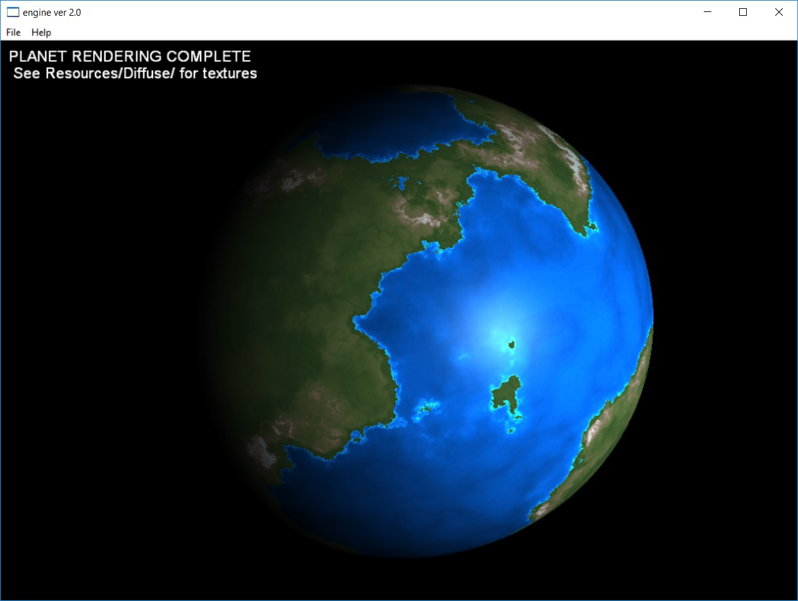

<!DOCTYPE html>
<html>
<head>

</head>

<body>
	<header id="header" role="banner">		   		

                
    </header>

    

        <h2> Description</h2>
    
This is a really old directX program that comes under the GPL for use of
        libnoise and a bit of math from celestia. The program effectively genererates
        the noise planet example on cpu then copies opens the images, copies them
        to a hardware texture using a lockable texture object then hopefully copies them
        into the D3D_USAGE_DYNAMIC data pool for faster rendering. I think I wrote this in 2008.
        Also the shader is from Realtime Shaders by Wolfgang Engel.
        

    

    
        

        <h2> Building</h2>
    
This should build cleanly with microsoft visual studio, the program will through an exception 
        if run from visual studio using ctrl+f5 however if you navigate to the root directory there should
        be an executable that can be run by double clicking.
        

    

</body>
</html>
